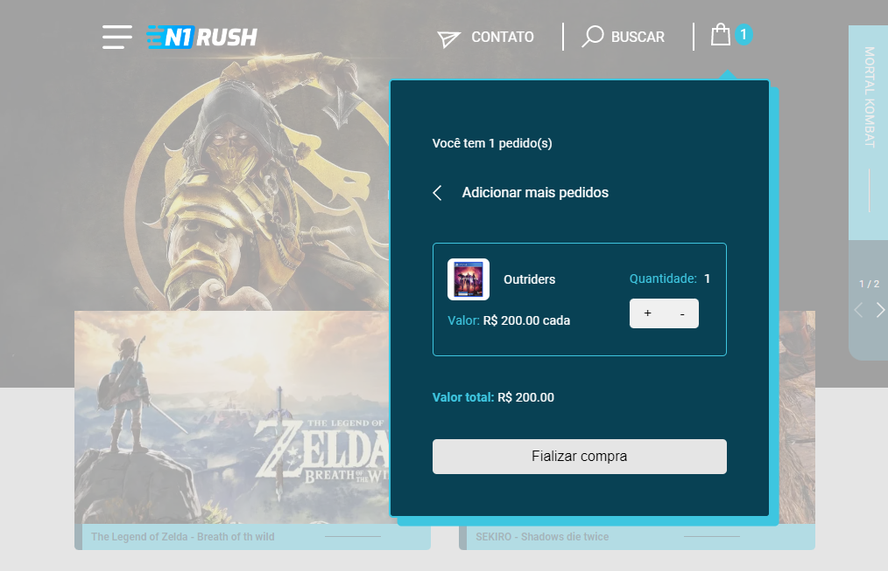

<h1 align="center">Games landing-page</h1>

<h1 align="center">

</h1>

<h4 align="center">
    Acesse a aplicação online pelo 
    <a href="https://landing-page-henna-two.vercel.app/">link</a>.
<h4>

##  Sobre

Tratando-se de uma landing-page de games, o sistema possui, entre outras, a funcionalidade de inserção dos produtos selecionados à 'sacola de compras'. Para isso, o sistema soma ou subtrai a quantidade de produtos e calcula o valor total da compra.
O projeto foi desenvolvido como um desafio pessoal de habilidades frontend.

---

## Tecnologias usadas

O projeto foi desenvolvido utilizando as seguintes tecnologias:

- HTML5;
- CSS;
- JavaScript;
- React / Styled-component;
- Vite;
- Mobile-first;
- VS Code.

---

## Acesso ao projeto
    - Clone o repositório; 
    - Acesse o diretório;
    - Instale as dependências.
   
---

